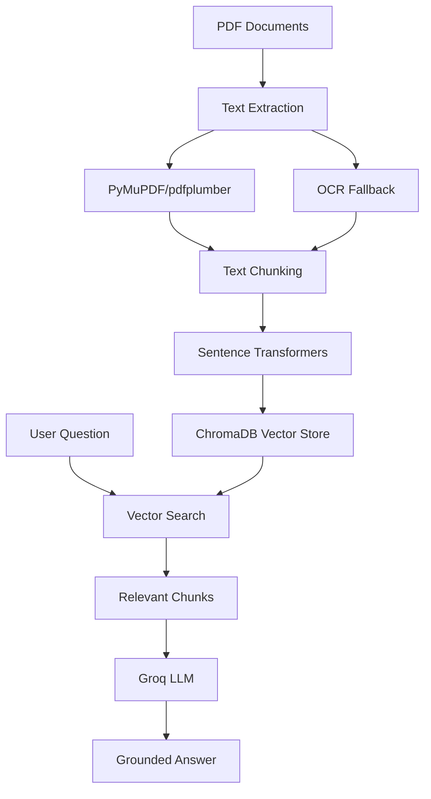

# PDF RAG Assistant

A production-ready **Retrieval-Augmented Generation (RAG)** system for PDF documents. Upload PDFs, ask natural language questions, and get accurate answers grounded in your documents with zero hallucination.

[](https://www.python.org/downloads/)
[](https://streamlit.io/)
[](https://opensource.org/licenses/MIT)

---

## ✨ Features

- **📄 Smart PDF Processing** — Extract text from regular and image-based (OCR) PDFs
- **🧠 Vector Search** — ChromaDB with Sentence Transformers for semantic similarity
- **⚡ Fast LLM** — Groq's `llama-3.1-8b-instant` for quick, accurate responses
- **🎨 Clean UI** — Streamlit web interface with drag-and-drop upload
- **🔄 Dual Mode** — Vector search with keyword fallback when ML dependencies are unavailable
- **🌐 Cross-platform** — Works on Windows, macOS, and Linux
- **🚀 Production Ready** — Environment variables, proper logging, error handling

---

## 🛠️ Tech Stack

| Component | Technology |
|-----------|------------|
| **PDF Processing** | PyMuPDF, pdfplumber |
| **OCR Support** | Tesseract + pdf2image + Pillow |
| **Embeddings** | Sentence Transformers (`all-MiniLM-L6-v2`) |
| **Vector Database** | ChromaDB |
| **LLM** | Groq API (`llama-3.1-8b-instant`) |
| **Web Interface** | Streamlit |
| **Configuration** | python-dotenv |

---

## 📁 Project Structure

```
pdf-rag-assistant/
│
├── ingestion/
│   └── ingest_pdfs.py          # PDF text extraction & chunking
│
├── rag/
│   ├── chroma_retrieval.py     # Vector search & retrieval
│   └── groq_answering.py       # LLM answer generation
│
├── utils/
│   └── helpers.py              # Logging & utility functions
│
├── data/                       # PDF documents (add your PDFs here)
├── chroma_db/                  # Vector database (auto-generated)
│
├── config.py                   # Configuration settings
├── main.py                     # Command-line interface
├── streamlit_app.py            # Web interface (recommended)
├── requirements.txt            # Python dependencies
├── .env.example               # Environment template
└── README.md                  # This file
```

---

## 🚀 Quick Start

### 1. **Clone & Setup**

```bash
git clone <your-repository-url>
cd pdf-rag-assistant
```

### 2. **Create Virtual Environment**

```bash
python -m venv venv

# Windows
venv\Scripts\activate

# macOS/Linux
source venv/bin/activate
```

### 3. **Install Dependencies**

```bash
pip install -r requirements.txt
```

### 4. **Configure Environment**

```bash
cp .env.example .env
```

Edit `.env` and add your Groq API key:

```env
GROQ_API_KEY=your_groq_api_key_here
```

> 💡 **Get a free Groq API key:** https://console.groq.com/keys

### 5. **Add PDF Documents**

Place your PDF files in the `data/` directory:

```bash
mkdir -p data
# Copy your PDF files to data/ folder
```

### 6. **Run the Application**

**Option A: Web Interface (Recommended)**
```bash
streamlit run streamlit_app.py
```
Then open http://localhost:8501 in your browser.

**Option B: Command Line Interface**
```bash
python main.py
```

---

## 💡 How It Works



### Processing Pipeline

1. **📄 PDF Ingestion**: Extract text using PyMuPDF/pdfplumber with OCR fallback for scanned documents
2. **✂️ Text Chunking**: Split documents into overlapping chunks (800 chars, 150 overlap)
3. **🧠 Embeddings**: Generate vector representations using Sentence Transformers
4. **💾 Storage**: Store vectors in ChromaDB for fast similarity search
5. **🔍 Retrieval**: Find relevant chunks using semantic similarity
6. **🤖 Generation**: Generate contextual answers using Groq's LLM

---

## ⚙️ Configuration

All settings are centralized in `config.py` with environment variable overrides:

| Setting | Default | Description |
|---------|---------|-------------|
| `GROQ_API_KEY` | *Required* | Your Groq API key |
| `CHUNK_SIZE` | `800` | Characters per text chunk |
| `CHUNK_OVERLAP` | `150` | Overlap between chunks |
| `MAX_CHUNKS` | `10` | Maximum chunks per query |
| `SIMILARITY_THRESHOLD` | `0.3` | Minimum similarity score |
| `GROQ_MODEL` | `llama-3.1-8b-instant` | Groq model name |
| `EMBEDDING_MODEL` | `all-MiniLM-L6-v2` | Sentence transformer model |
| `MAX_CONTEXT_TOKENS` | `4000` | Context token limit |
| `MAX_RESPONSE_TOKENS` | `1000` | Response token limit |

### Environment Variables

Create a `.env` file (copy from `.env.example`):

```env
# Required
GROQ_API_KEY=your_groq_api_key_here

# Optional overrides
CHUNK_SIZE=800
CHUNK_OVERLAP=150
MAX_CHUNKS=10
GROQ_MODEL=llama-3.1-8b-instant
EMBEDDING_MODEL=all-MiniLM-L6-v2
LOG_LEVEL=INFO
```

---

## 🔧 OCR Support for Scanned PDFs

To process image-based or scanned PDFs, install these external tools:

### **Tesseract OCR**

- **Windows**: Download from [UB Mannheim](https://github.com/UB-Mannheim/tesseract/wiki)
- **macOS**: `brew install tesseract`
- **Linux**: `sudo apt install tesseract-ocr`

### **Poppler (pdf2image dependency)**

- **Windows**: Download from [poppler-windows](https://github.com/oschwartz10612/poppler-windows/releases), extract and add `bin/` to PATH
- **macOS**: `brew install poppler`
- **Linux**: `sudo apt install poppler-utils`

> 💡 The system automatically falls back to OCR when standard text extraction yields minimal content.

---

## 🚨 Troubleshooting

<details>
<summary><strong>ImportError: No module named 'sentence_transformers'</strong></summary>

```bash
pip install sentence-transformers
```
</details>

<details>
<summary><strong>OCR not working on Windows</strong></summary>

1. Install Tesseract from the [official Windows installer](https://github.com/UB-Mannheim/tesseract/wiki)
2. Add Tesseract to your PATH, or set `TESSERACT_PATH` in `.env`:
   ```env
   TESSERACT_PATH=C:\Program Files\Tesseract-OCR\tesseract.exe
   ```
3. Install Poppler and add to PATH
</details>

<details>
<summary><strong>ChromaDB errors</strong></summary>

Try resetting the database:
```bash
rm -rf chroma_db/
```
Restart the application to rebuild the vector database.
</details>

<details>
<summary><strong>Groq API errors</strong></summary>

1. Check your API key in `.env`
2. Ensure you have Groq credits/quota
3. Try a different model in `GROQ_MODEL` environment variable
</details>

---

## 📝 License

MIT License - see [LICENSE](LICENSE) file for details.

---

## 🤝 Contributing

1. Fork the repository
2. Create a feature branch (`git checkout -b feature/amazing-feature`)
3. Commit your changes (`git commit -m 'Add amazing feature'`)
4. Push to the branch (`git push origin feature/amazing-feature`)
5. Open a Pull Request

---

## ⭐ Acknowledgments

- [Groq](https://groq.com/) for fast LLM inference
- [ChromaDB](https://www.trychroma.com/) for vector storage
- [Sentence Transformers](https://www.sbert.net/) for embeddings
- [Streamlit](https://streamlit.io/) for the web interface
